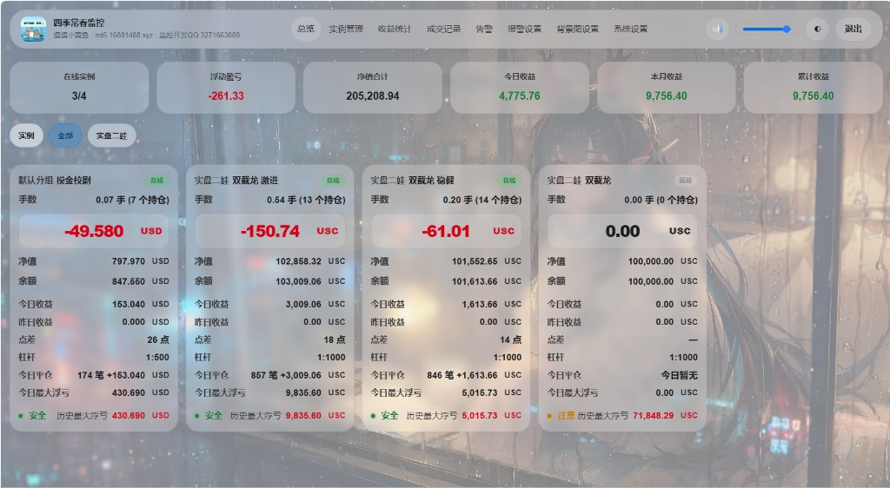
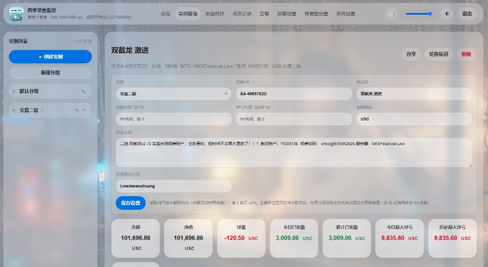
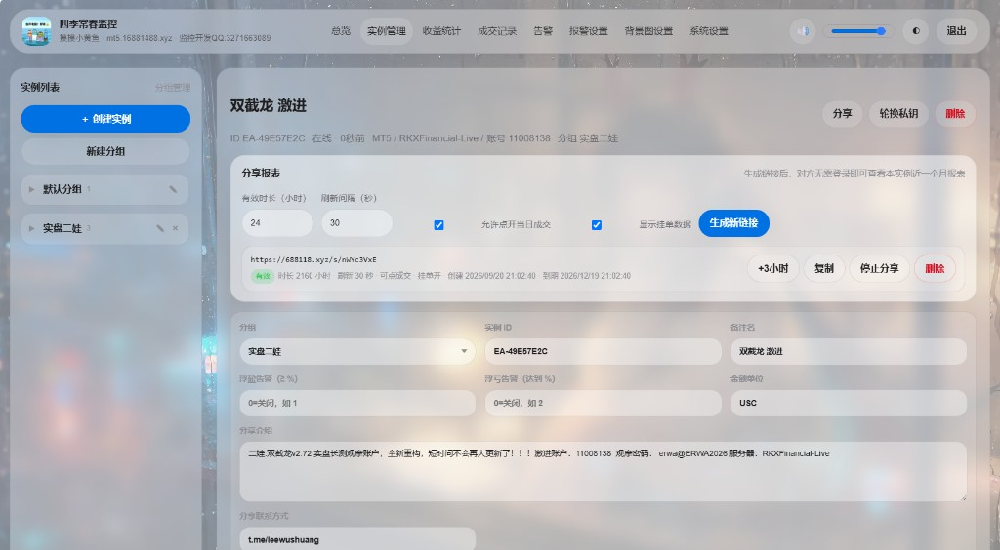
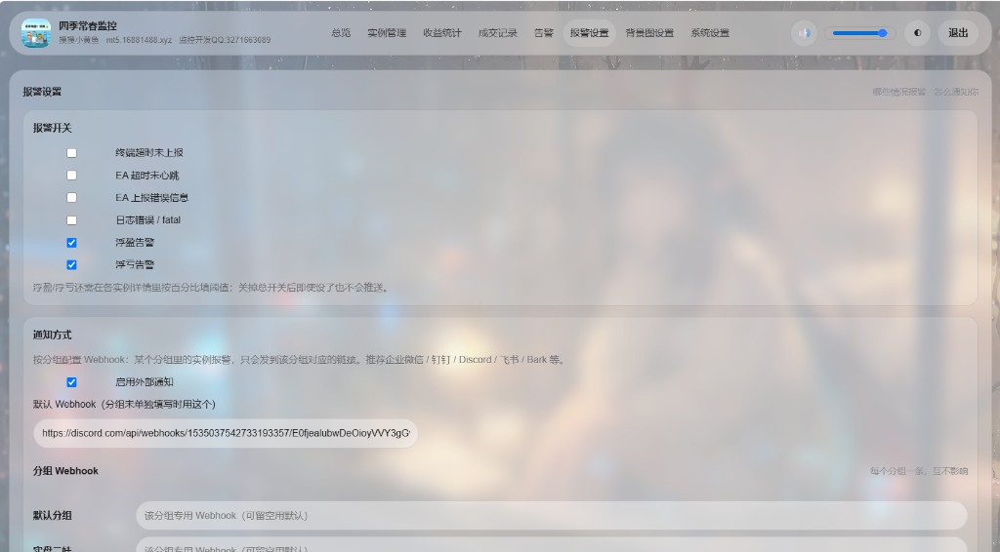

# 四季常春监控公益版 · 站点功能说明

本文介绍「四季常春监控公益版」能做什么。部署后你得到的是**空站点**：没有别人的成交、实例或分享数据，所有记录都是你自己接入 EA 后产生的。

界面示意如下（演示站截图，仅作功能参考）：

## 1. 总览

登录后默认进入总览，一眼看到所有实例：

- **汇总卡片**：在线实例数、浮动盈亏、净值合计、今日 / 本月 / 累计收益
- **实例卡片**：在线状态、手数与持仓、浮盈、余额净值、点差杠杆、今日/昨日收益、今日平仓笔数、今日最大浮亏、安全度提示
- 支持亮色 / 暗色主题，以及自定义背景图

## 2. 实例管理

左侧按**分组**管理实例，可新建分组、创建实例：

- 查看实例 ID、在线状态、平台 / 服务器 / 账号
- 备注名、分组归属、显示货币单位（如 USD / USC）
- 浮盈 / 浮亏告警阈值（百分比，可关闭）
- 分享文案与联系方式（写在分享页上，给观摩者看）
- 轮换私钥、删除实例

创建实例后，把 **实例 ID + 私钥** 填进 MT4/MT5 监控 EA，API 地址填你自己的域名即可开始上报。

## 3. 分享报表

每个实例可生成只读分享短链（例如 `/s/xxxx`）：

- 设置有效时长（小时）、页面刷新间隔
- 可选：是否允许查看当日成交、是否显示挂单/持仓
- 生成、复制、停止分享、删除链接
- 访客无需登录，只能看到你允许公开的内容

适合给客户或观摩者看实盘表现，无需开放后台。

## 4. 收益统计与成交记录

- **收益统计**：按日 / 月查看盈亏日历，点击某天可看当日平仓明细
- **成交记录**：按分组 → 实例筛选，查看近期成交，可导出 CSV

## 5. 告警与通知

- **告警开关**：终端超时、EA 心跳超时、EA 错误、日志错误、浮盈告警、浮亏告警
- **外部通知**：企业微信 / 钉钉 / Discord / 飞书 / Bark 等 Webhook
- 可配置默认 Webhook，也可按分组单独配置
- **告警**页可查看历史告警记录

浮盈 / 浮亏是否触发，还取决于各实例详情里设置的百分比阈值。

## 6. 其它设置

- **背景图设置**：上传日间 / 夜间、桌面 / 手机背景（支持图片或视频）
- **系统设置**：修改管理员账号密码、查看运行状态等
- **声音**：浮盈浮亏触线时可播放提示音（可静音、调音量）

## 数据归属说明

| 内容 | 在哪里 |
|------|--------|
| 本仓库源码 | GitHub，所有人可见 |
| 你的实例 / 成交 / 分享链接 | 只存在**你自己服务器**的数据库里 |
| 别人部署后的数据 | 在**他们自己**的服务器上，互不相通 |

开源的是程序，不是任何实盘数据。
